# HabitTracker

A standalone Python desktop application for creating and tracking habits and goals. Built with PySide6, designed with a mobile-first layout (390×780), and stores all data locally in JSON files — no internet connection required.

*Developed in May–June 2026 as a university project; published to GitHub in September 2026.*

---

## Screenshots

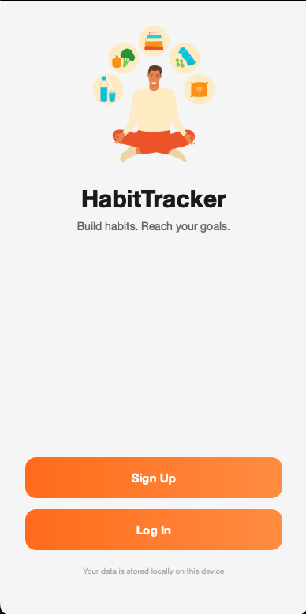

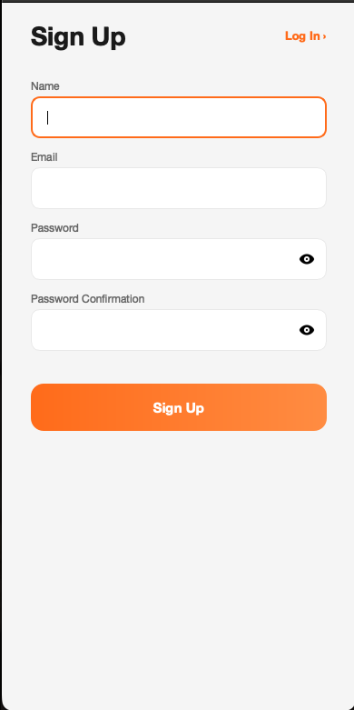

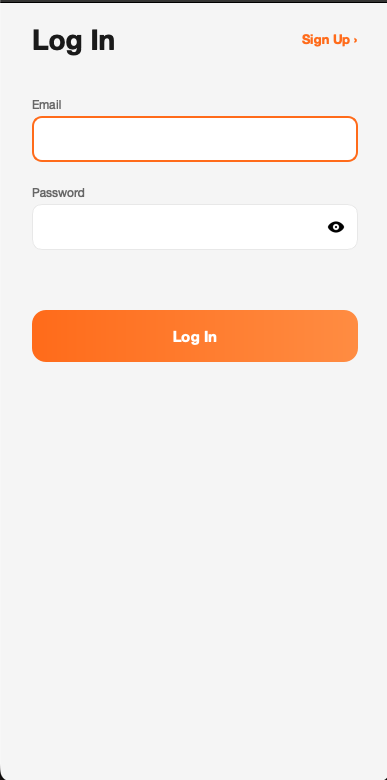

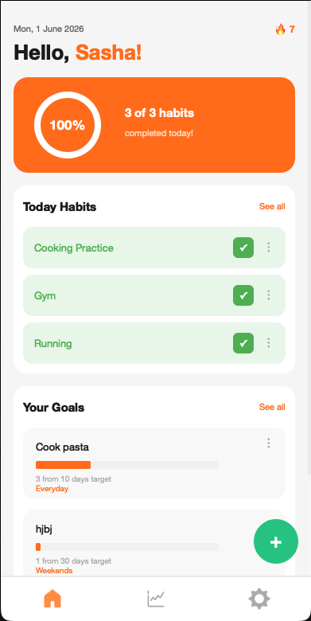

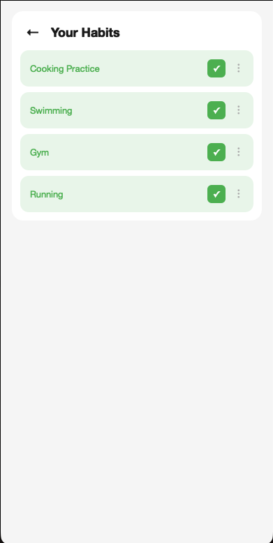

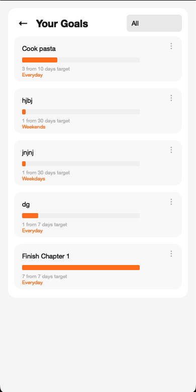

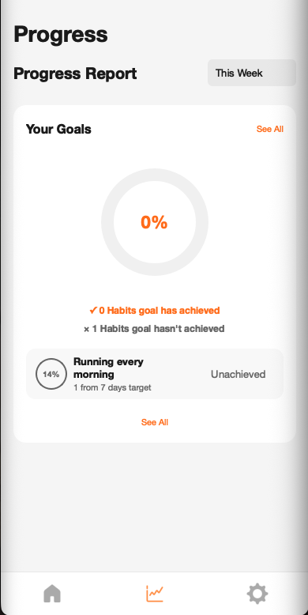

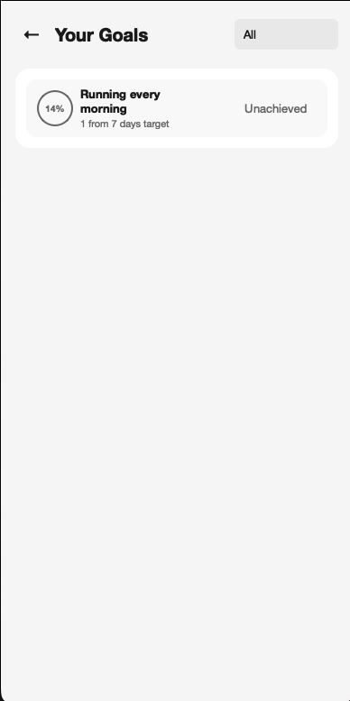

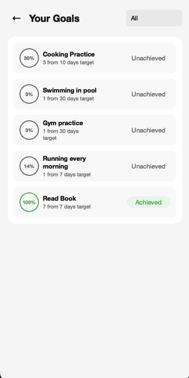

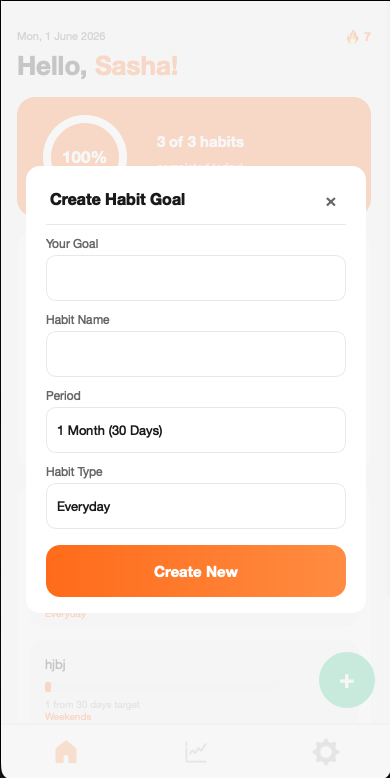

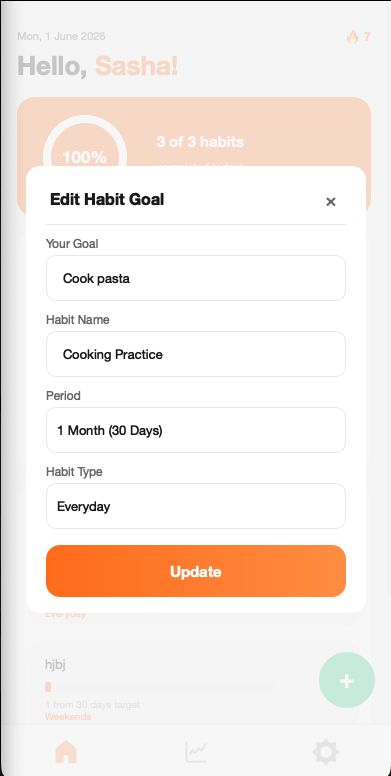

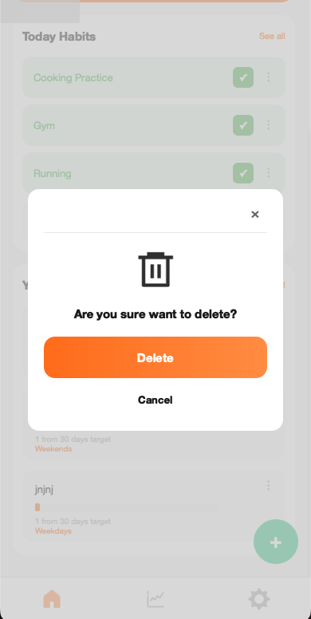

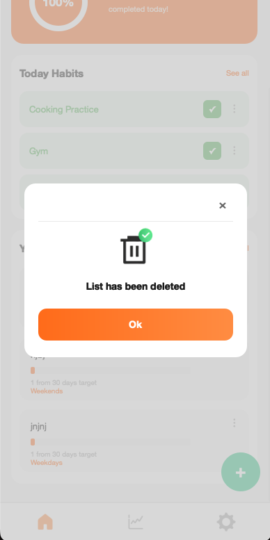

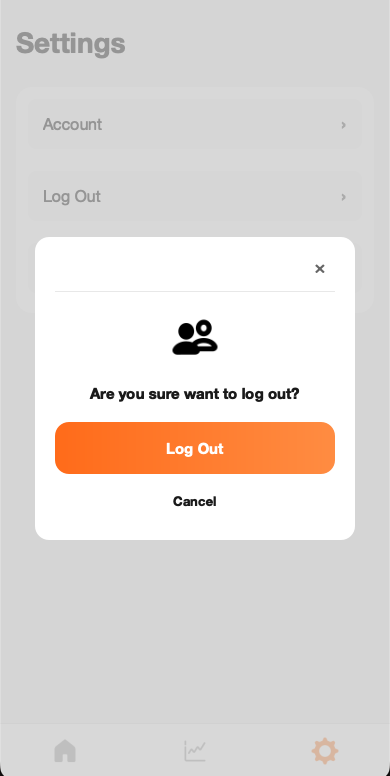

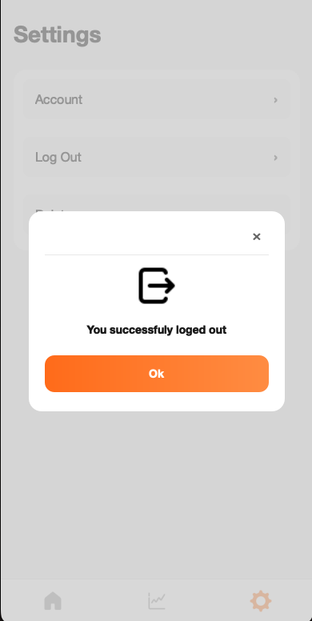

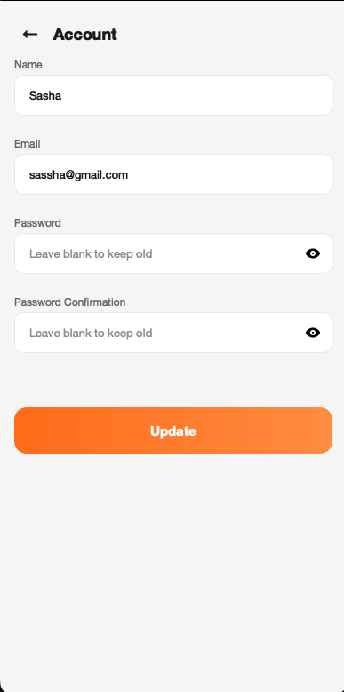

---

## Features

- Sign-up and log-in with validation (name casing, gmail-only emails, password rules); passwords are stored as SHA-256 hashes
- Create, edit, and delete habits with custom goal types
- Smart daily dashboard — habits appear based on their schedule: **Everyday**, **Weekdays**, or **Weekends**
- Streak calculation per habit
- Progress filters: week, 2 weeks, month, 3 months, year
- Goal tracking with progress and completion status
- Account management (update name, email, password; delete account)
- Platform-aware typography: Helvetica Neue on macOS, Segoe UI on Windows
- All data stored locally — no backend, no cloud

---

## Tech Stack

- **Python** 3.10+
- **PySide6** — Qt6 bindings for GUI
- **python-dateutil** — date arithmetic for streaks and progress filters
- **pytest** — unit tests (dev dependency)

---

## Requirements

- Python 3.10 or newer
- pip

---

## Installation

```bash
# 1. Clone the repository and move into it
git clone https://github.com/Vosapgogo/habit-tracker.git
cd habit-tracker

# 2. Create and activate a virtual environment
python3 -m venv venv

# macOS / Linux
source venv/bin/activate

# Windows (PowerShell)
venv\Scripts\Activate.ps1

# Windows (cmd)
venv\Scripts\activate.bat

# 3. Install dependencies
pip install -r requirements.txt
```

---

## Running the App

```bash
python main.py
```

The application window will open at a fixed 390×780 size.

---

## Running the Tests

```bash
pip install -r requirements-dev.txt
pytest
```

The tests cover input validation and the persistence layer (`models/user_session.py`). They run against a temporary directory, so your real `users.json` and `session.json` are never touched.

---

## Project Structure

```
HabitTracker/
├── main.py                   # Entry point
├── requirements.txt
├── requirements-dev.txt      # Adds pytest for running the tests
├── pytest.ini
├── users.json                # Local user data (git-ignored, created at runtime)
├── session.json              # Active session (git-ignored, created at runtime)
│
├── models/
│   └── user_session.py       # All data persistence logic (CRUD for users, habits, goals)
│
├── tests/
│   ├── test_validation.py    # Input validation rules
│   └── test_user_session.py  # Persistence logic (runs against a temp directory)
│
└── pages/
    ├── app.py                # Main router — QStackedWidget controller
    ├── constants.py          # Global colors, fonts
    ├── welcome_p.py
    ├── signup_p.py
    ├── login_p.py
    ├── done_p.py
    ├── home_p.py
    ├── habits_p.py
    ├── goals_p.py
    ├── progress_p.py
    ├── progress_goal_p.py
    ├── settings_p.py
    ├── account_p.py
    │
    ├── components/           # Reusable UI widgets
    │   ├── bottom_nav.py
    │   ├── fab.py
    │   ├── habit_card.py
    │   ├── goal_card.py
    │   ├── modal.py
    │   └── ...
    │
    └── utils/
        ├── errors.py         # Custom exceptions (ValidationError, UserNotFoundError, DataStorageError)
        └── helpers.py        # Decorators, validators, generators
```

---

## Known Limitations

- Passwords are stored as **unsalted SHA-256 hashes** — better than plain text, but not production-grade (a real deployment would need a salted, slow hash such as bcrypt or argon2)
- Single-user session at a time
- No data export or backup mechanism
- Only `@gmail.com` emails are accepted at registration

---

## License

MIT License — feel free to use, modify, and distribute.
